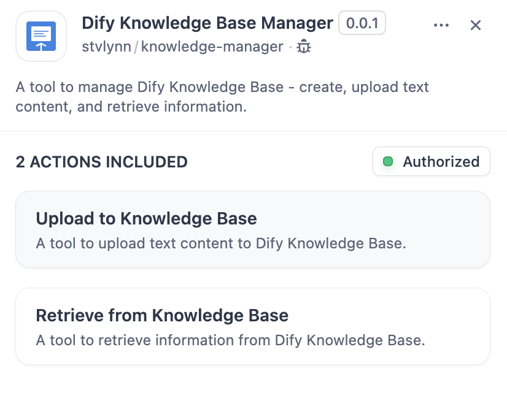
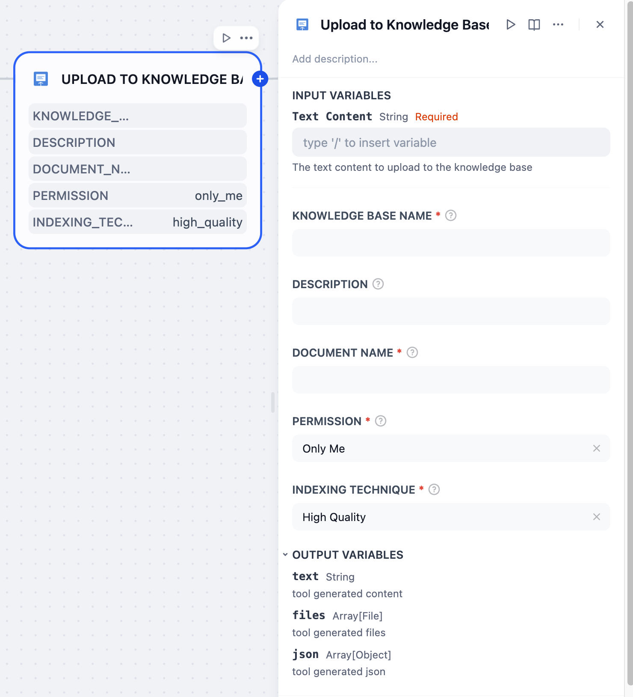
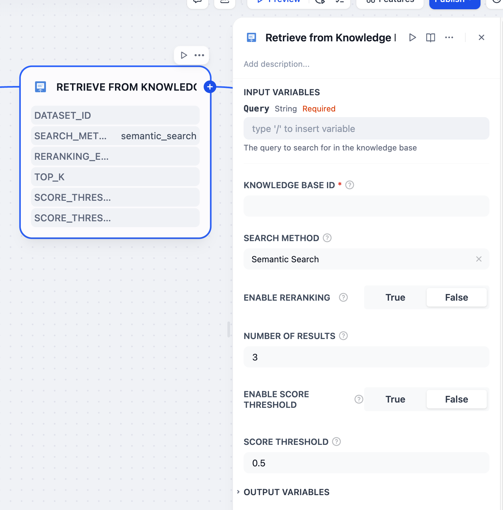

# Dify Knowledge Base Manager Plugin

A plugin for managing Dify knowledge base - creating knowledge bases, uploading text content, and retrieving information.


## Prerequisites

Before using this plugin, you need:

1. A Dify platform account
2. Knowledge base API Key

## How to Get API Key

1. Log in to [Dify.ai](https://cloud.dify.ai)
2. Navigate to the knowledge base page
3. Switch to the **API Access** page from the left navigation
4. Manage access credentials in the **API Keys** section
<iframe
  src="https://www.motionshot.app/walkthrough/67d03b3a6058d05660c65e41/embed?hideSteps=1&hideAsSteps=1&hideDownload=1&hideCopy=1&fullscreen=1"
  width="100%"
  style='border: 1px solid rgba(0,0,0,0.16); border-radius: 20px; min-height: 740px'
></iframe>

## How to Get Knowledge Base ID

The knowledge base ID can be obtained from the knowledge base URL, for example:
`https://app.dify.ai/datasets/12345678-1234-1234-1234-123456789012`
where `12345678-1234-1234-1234-123456789012` is the knowledge base ID.

## Upload Tool Parameters


- **Knowledge Base Name**: The name of the knowledge base to create
- **Description**: Description of the knowledge base (optional)
- **Document Name**: The name of the document to create
- **Text Content**: The text content to upload
- **Permission**: Knowledge base permission settings
  - only_me: Only the creator can access
  - publicly_readable: Everyone can read
- **Indexing Technology**: Choose high_quality or economy mode

## Retrieve Tool Parameters


- **Knowledge Base ID**: The ID of the knowledge base to retrieve from (required)
- **Query**: The query to search for in the knowledge base (required)
- **Search Method**: The method to use for searching the knowledge base (optional, default is semantic search)
  - keyword_search: Keyword search, based on keyword matching
  - semantic_search: Semantic search, based on semantic understanding
  - full_text_search: Full text search, searches the entire text content
  - hybrid_search: Hybrid search, combines keyword and semantic search
- **Enable Reranking**: Whether to enable reranking of search results (optional, default is false)
- **Number of Results**: The number of results to return (optional, default is 3)
- **Enable Score Threshold**: Whether to enable score threshold filtering (optional, default is false)
- **Score Threshold**: The minimum score threshold for results (0-1) (optional, default is 0.5)

## Upload Output

The upload tool returns a JSON response with the following structure:
```json
{
  "status": "success",
  "knowledge_base_id": "12345678-1234-1234-1234-123456789012",
  "knowledge_base": {
    "id": "12345678-1234-1234-1234-123456789012",
    "name": "Knowledge Base Name"
  },
  "document": {
    "id": "document-id",
    "name": "Document Name",
    "batch": "batch-id",
    "status": "completed"
  }
}
```

## Retrieve Output

The retrieve tool returns a JSON response with the following structure:
```json
{
  "status": "success",
  "query": "Query content",
  "knowledge_base_id": "Knowledge base ID",
  "results": [
    {
      "segment": {
        "id": "Segment ID",
        "content": "Segment content",
        "document": {
          "id": "Document ID",
          "name": "Document name"
        }
      },
      "score": 0.95
    }
  ]
}
```

The `knowledge_base_id` field can be used for further operations with the knowledge base.

## Notes

- Text content requires some time for processing and indexing after upload
- Processing large amounts of text may take longer
- If processing is not complete, the plugin will return the current status, and you can check the processing results later on the Dify platform
- Text content will be automatically segmented for processing, using automatic mode by default

## Supported File Formats

- Text files (.txt)
- PDF files (.pdf)
- Word documents (.doc, .docx)
- Markdown files (.md, .markdown)
- HTML files (.html, .htm)
- Excel files (.xlsx)
- CSV files (.csv)


